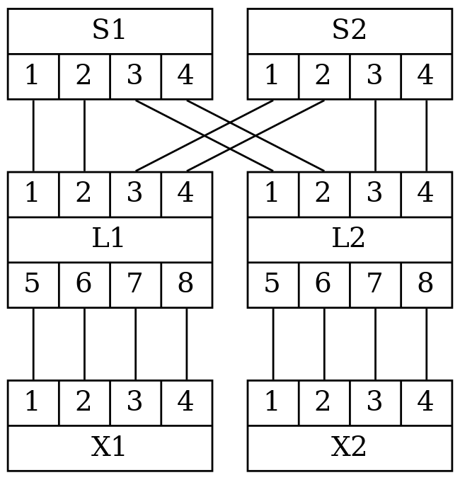
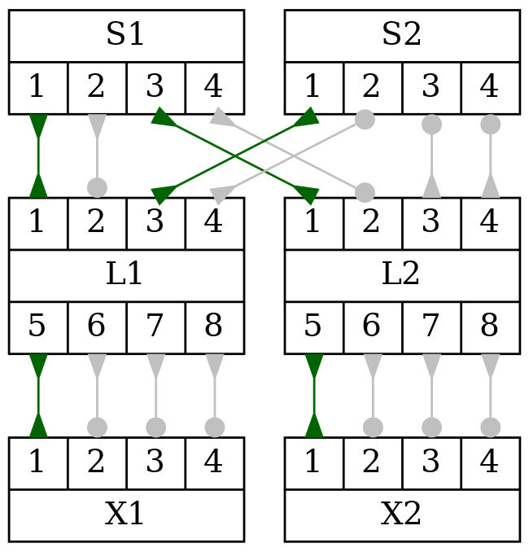

# STP Simulator

This is a Python application that simulates the spanning tree algorithm used to prevent loops in an Ethernet switched network.
The application reads a network representation as a DOT file, similar to the one shown below and produces an output showing the role and status of each port of the network switches.

The spanning tree algorithm is based on the description in *Radia Perlman. 1999. Interconnections (2nd ed.): bridges, routers, switches, and internetworking protocols. Addison-Wesley Longman Publishing Co., Inc., USA.*

## Known limitations

- Timing and timers are ignored. The simulation will run for x number of steps and produces the results. Make sure that simulation steps are sufficient for the STP to converge.
- A switch's self-loop is not handled correctly.

## Example Network

```
graph G {
  graph [splines=false dpi=200];
  node [shape=record];

  S1 [mac="FF:FF:FF:00:00:10" label="{S1|{<1>1|<2>2|<3>3|<4>4}}"];
  S2 [mac="FF:FF:FF:00:00:20" label="{S2|{<1>1|<2>2|<3>3|<4>4}}"];

  L1 [mac="FF:FF:FF:00:10:FF" label="{{<1>1|<2>2|<3>3|<4>4}|L1|{<5>5|<6>6|<7>7|<8>8}}}"];
  L2 [mac="FF:FF:FF:00:20:FF" label="{{<1>1|<2>2|<3>3|<4>4}|L2|{<5>5|<6>6|<7>7|<8>8}}}"];

  X1 [mac="FF:FF:FF:10:FF:FF" label="{{<1>1|<2>2|<3>3|<4>4}|X1}"];
  X2 [mac="FF:FF:FF:20:FF:FF" label="{{<1>1|<2>2|<3>3|<4>4}|X2}"];

  S1:1:s -- L1:1:n;
  S1:2:s -- L1:2:n;
  S1:3:s -- L2:1:n;
  S1:4:s -- L2:2:n;

  S2:1:s -- L1:3:n;
  S2:2:s -- L1:4:n;
  S2:3:s -- L2:3:n;
  S2:4:s -- L2:4:n;
  
  L1:5:s -- X1:1:n;
  L1:6:s -- X1:2:n;
  L1:7:s -- X1:3:n;
  L1:8:s -- X1:4:n;
  
  L2:5:s -- X2:1:n;
  L2:6:s -- X2:2:n;
  L2:7:s -- X2:3:n;
  L2:8:s -- X2:4:n;
}
```



(For extra options available, see the examples directory.)

## Installation

- clone this repository
- Install required Python modules

## Usage

Run the application with a dot file as an input

```
$ python3 stp_simulator.py -i network.dot -o network-stp.png
```

The output PNG contains the rendered STP stimulation result.



The output should be similar to this:

```
Bridge: S1:      
ID: 0x8000ffffff000010. This bridge is Root.
-----------------------------------------------------------------
Port     Role            Status          Cost     Cost-to-Root   
-----------------------------------------------------------------
1        Designated      Forwarding      100      -              
2        Designated      Forwarding      100      -              
3        Designated      Forwarding      100      -              
4        Designated      Forwarding      100      -              

Bridge: L1:
ID: 0x8000ffffff0010ff. 
-----------------------------------------------------------------
Port     Role            Status          Cost     Cost-to-Root   
-----------------------------------------------------------------
1        Root Port       Forwarding      100      100            
2        Undesignated    Blocked         100      -              
3        Designated      Forwarding      100      -              
4        Designated      Forwarding      100      -              
5        Designated      Forwarding      100      -              
6        Designated      Forwarding      100      -              
7        Designated      Forwarding      100      -              
8        Designated      Forwarding      100      -              

Bridge: L2:
ID: 0x8000ffffff0020ff. 
-----------------------------------------------------------------
Port     Role            Status          Cost     Cost-to-Root   
-----------------------------------------------------------------
1        Root Port       Forwarding      100      100            
2        Undesignated    Blocked         100      -              
3        Designated      Forwarding      100      -              
4        Designated      Forwarding      100      -              
5        Designated      Forwarding      100      -              
6        Designated      Forwarding      100      -              
7        Designated      Forwarding      100      -              
8        Designated      Forwarding      100      -              

Bridge: S2:
ID: 0x8000ffffff000020. 
-----------------------------------------------------------------
Port     Role            Status          Cost     Cost-to-Root   
-----------------------------------------------------------------
1        Root Port       Forwarding      100      200            
2        Undesignated    Blocked         100      -              
3        Undesignated    Blocked         100      -              
4        Undesignated    Blocked         100      -              

Bridge: X1:
ID: 0x8000ffffff10ffff. 
-----------------------------------------------------------------
Port     Role            Status          Cost     Cost-to-Root   
-----------------------------------------------------------------
1        Root Port       Forwarding      100      200            
2        Undesignated    Blocked         100      -              
3        Undesignated    Blocked         100      -              
4        Undesignated    Blocked         100      -              

Bridge: X2:
ID: 0x8000ffffff20ffff. 
-----------------------------------------------------------------
Port     Role            Status          Cost     Cost-to-Root   
-----------------------------------------------------------------
1        Root Port       Forwarding      100      200            
2        Undesignated    Blocked         100      -              
3        Undesignated    Blocked         100      -              
4        Undesignated    Blocked         100      -              
```

A log file can be produced to show details:

```
$ python3 stp_simulator.py -i network.dot -o network-stp.png -l DEBUG
```

The simulation steps should be proportional to the size of the network to ensure that all switches receive the root's BPDU. Use the option '-s' to change the default number of steps (10):

```
$ python3 stp_simulator.py -i network.dot -s 20
```
